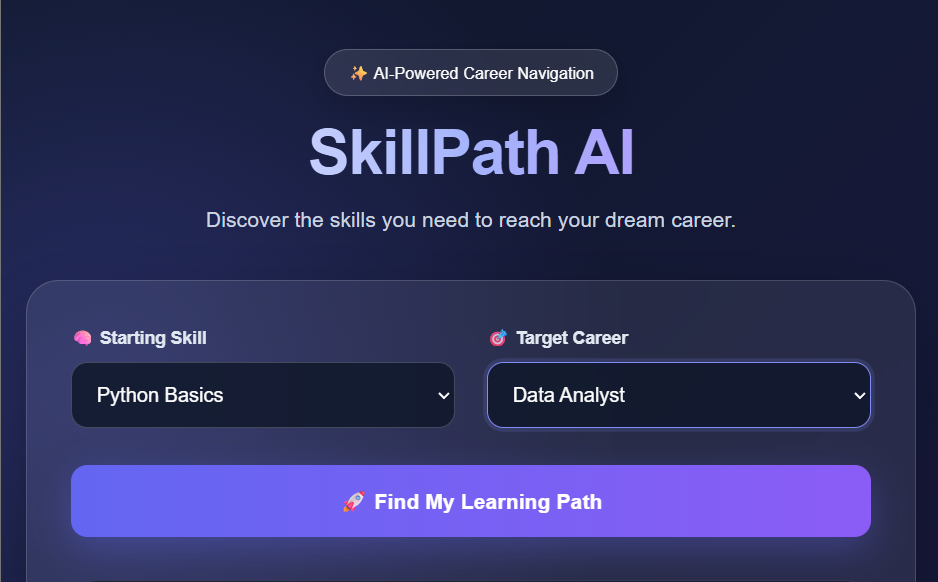
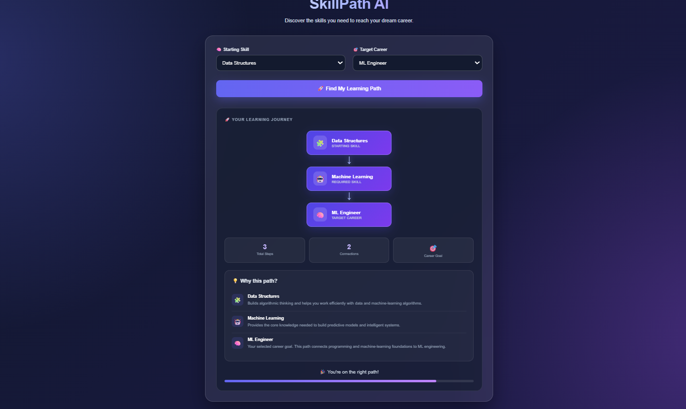
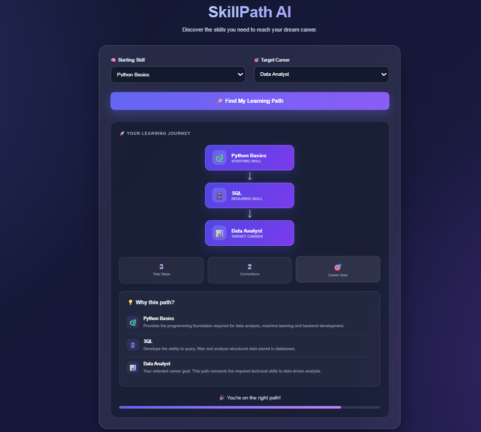

# 🚀 SkillPath AI

### AI-Powered Career Learning Path Advisor

SkillPath AI is a graph-based career navigation application that helps users discover the skills they need to reach a target career.

A user selects a **starting skill** and a **target career**, and the application finds the shortest learning path between them using a graph database.

---

## 🌐 Live Demo

https://skillpath-ai-77e4.onrender.com

## 💻 GitHub Repository

https://github.com/Kashish123-code/skillpath-ai

---

## 🎯 Problem Statement

Students and beginners often know the career they want but are unsure about the skills they should learn first.

For example:

> "I know Python. What should I learn to become a Data Analyst?"

SkillPath AI solves this problem by representing skills and careers as a connected graph and finding a suitable learning path between them.

---

## ✨ Features

- 🎯 Select a starting skill
- 💼 Select a target career
- 🧠 Graph-based career navigation
- 🔗 Finds the shortest learning path
- ⚡ Real-time path retrieval through Flask API
- 🌐 Interactive web interface
- ☁️ Deployed publicly using Render
- 🗄️ Uses CognoDB / Neo4j-compatible graph database
- 📊 Visual learning journey
- 🚀 Production deployment using Gunicorn

---

## 🛠️ Tech Stack

### Frontend

- HTML
- CSS
- JavaScript

### Backend

- Python
- Flask

### Database

- CognoDB Cloud
- Neo4j Python Driver
- Cypher

### Deployment

- GitHub
- Render
- Gunicorn

---

## 🧠 How It Works

SkillPath AI represents the career ecosystem as a graph.

### Nodes

The application uses two main types of nodes:

```text
Skill
Career
```

Examples of skills:

```text
Python Basics
Data Structures
SQL
Machine Learning
Flask
```

Examples of careers:

```text
Data Analyst
ML Engineer
Backend Developer
```

### Relationships

Skills are connected using:

```text
PREREQUISITE_OF
```

Skills are connected to careers using:

```text
REQUIRED_FOR
```

For example:

```text
Python Basics
      |
      | PREREQUISITE_OF
      ↓
Data Structures
      |
      | PREREQUISITE_OF
      ↓
Machine Learning
      |
      | REQUIRED_FOR
      ↓
ML Engineer
```

---

## 🔍 Example Learning Paths

### Example 1 — Data Analyst

Starting Skill:

```text
Python Basics
```

Target Career:

```text
Data Analyst
```

Learning Path:

```text
Python Basics → SQL → Data Analyst
```

### Example 2 — ML Engineer

Starting Skill:

```text
Data Structures
```

Target Career:

```text
ML Engineer
```

Learning Path:

```text
Data Structures → Machine Learning → ML Engineer
```

### Example 3 — Backend Developer

Starting Skill:

```text
Python Basics
```

Target Career:

```text
Backend Developer
```

Learning Path:

```text
Python Basics → Flask → Backend Developer
```

---

## 🗄️ Why a Graph Database?

Career learning paths naturally contain relationships between different skills and careers.

A graph database is useful because it allows the application to model these relationships directly.

For example:

```text
Python Basics
      ↓
Data Structures
      ↓
Machine Learning
      ↓
ML Engineer
```

Each skill or career can be represented as a node, while the learning relationships can be represented as edges.

This makes graph traversal and path-finding a natural fit for the application.

---

## 🧮 Shortest Path Query

The backend uses a Cypher query to find the shortest path between the selected starting skill and target career.

```cypher
MATCH (start:Skill {name: $skill_name}),
      (end:Career {title: $career_title})

MATCH p = shortestPath(
    (start)-[:PREREQUISITE_OF|REQUIRED_FOR*]->(end)
)

RETURN [
    node IN nodes(p) |
    coalesce(node.name, node.title)
] AS path
```

The query finds a connected path from the selected skill to the selected career.

The nodes in the path are returned to the Flask backend and then displayed by the frontend.

---

## 🔄 Application Flow

```text
                USER
                  |
                  ↓
        Select Starting Skill
                  |
                  ↓
         Select Target Career
                  |
                  ↓
              FRONTEND
                  |
                  | GET /path/<skill>/<career>
                  ↓
          FLASK BACKEND
                  |
                  | Cypher Query
                  ↓
             COGNODB
                  |
                  | Shortest Path
                  ↓
          FLASK API RESPONSE
                  |
                  | JSON
                  ↓
              FRONTEND
                  |
                  ↓
        LEARNING PATH DISPLAY
```

---

## 📡 API Endpoints

### 1. Home Page

```http
GET /
```

Displays the SkillPath AI web application.

---

### 2. Database Connection Test

```http
GET /test-db
```

Tests the connection between the Flask application and CognoDB.

Expected response:

```text
Connected!
```

---

### 3. Find Learning Path

```http
GET /path/<skill_name>/<career_title>
```

Example:

```text
/path/Python%20Basics/Data%20Analyst
```

Example response:

```json
{
  "path": [
    "Python Basics",
    "SQL",
    "Data Analyst"
  ]
}
```

---

## 📁 Project Structure

```text
learning-path-advisor/
│
├── templates/
│   └── index.html
│
├── app.py
├── seed.py
├── requirements.txt
├── .gitignore
└── README.md
```

---

## ⚙️ Local Setup

### 1. Clone the Repository

```bash
git clone https://github.com/Kashish123-code/skillpath-ai.git
```

### 2. Open the Project

```bash
cd skillpath-ai
```

### 3. Create a Virtual Environment

Windows:

```bash
python -m venv venv
```

Activate it:

```bash
venv\Scripts\activate
```

### 4. Install Dependencies

```bash
pip install -r requirements.txt
```

### 5. Configure Environment Variables

Create a `.env` file in the project root:

```env
COGNODB_URI=your_cognodb_uri
COGNODB_USER=your_cognodb_user
COGNODB_PASSWORD=your_cognodb_password
```

**Never commit the `.env` file to GitHub.**

### 6. Seed the Database

Run:

```bash
python seed.py
```

Expected output:

```text
Seed data loaded successfully!
Career graph is ready.
```

### 7. Start the Flask Application

Run:

```bash
python app.py
```

The application will run at:

```text
http://127.0.0.1:5000/
```

Open the URL in your browser.

---

## ☁️ Deployment

The application is deployed using GitHub and Render.

Deployment architecture:

```text
GitHub
   |
   ↓
Render
   |
   ↓
Gunicorn
   |
   ↓
Flask Application
   |
   ↓
CognoDB Cloud
```

### Production Server

The application uses Gunicorn as the production WSGI server.

Start command:

```bash
gunicorn app:app
```

### Build Command

```bash
pip install -r requirements.txt
```

Environment variables are configured securely on the deployment platform.

---

## 🔐 Security

The application uses environment variables for database credentials.

The following values should never be committed to GitHub:

```text
COGNODB_URI
COGNODB_USER
COGNODB_PASSWORD
```

The `.env` file is excluded using `.gitignore`.

Never share your database password publicly.

---

## 🧪 Testing

The application can be tested using different combinations of starting skills and target careers.

Example:

```text
Starting Skill:
Python Basics

Target Career:
Data Analyst
```

Expected:

```text
Python Basics → SQL → Data Analyst
```

Another example:

```text
Starting Skill:
Data Structures

Target Career:
ML Engineer
```

Expected:

```text
Data Structures → Machine Learning → ML Engineer
```

If no connected path exists, the application displays:

```text
No path found between these two.
```

---

## 🚀 Future Improvements

The project can be extended with:

- 🤖 AI-powered career recommendations
- 📊 Skill gap analysis
- 📈 Career readiness score
- 🎓 Course recommendations
- 📚 Learning resource recommendations
- 💼 Job-role recommendations
- 👤 User profiles
- 📌 Learning progress tracking
- 📱 Improved mobile responsiveness
- 🔎 More skills and career paths
- 🧠 Personalized learning plans
- 🔗 More complex career-skill relationships

---

## 👨‍💻 Author

### Kashish Kharate

B.Tech — Computer Science & Engineering  
Artificial Intelligence & Machine Learning

### GitHub

https://github.com/Kashish123-code

### LinkedIn

https://www.linkedin.com/in/kashish-kharate-57062927a

---

## ⭐ Project Summary

SkillPath AI demonstrates how graph databases can be used to model relationships between technical skills and career paths.

The project combines:

```text
Graph Database
      +
Cypher
      +
Python
      +
Flask
      +
JavaScript
      +
Cloud Deployment
```

to create an interactive career learning path advisor.

---

## 📌 Project Status

```text
✅ Frontend Completed
✅ Flask Backend Completed
✅ CognoDB Integration Completed
✅ Graph Data Seeded
✅ Shortest Path Query Implemented
✅ GitHub Repository Created
✅ Render Deployment Completed
✅ Live Demo Available
```
## 🧩 Data Model

SkillPath AI represents skills and careers as nodes in a graph database.

### Graph Structure

```mermaid
graph LR

    S1[Python Basics]
    S2[Data Structures]
    S3[SQL]
    S4[Machine Learning]
    S5[Flask]

    C1[Data Analyst]
    C2[ML Engineer]
    C3[Backend Developer]

    S1 -->|PREREQUISITE_OF| S2
    S1 -->|PREREQUISITE_OF| S3
    S1 -->|PREREQUISITE_OF| S5
    S2 -->|PREREQUISITE_OF| S4

    S3 -->|REQUIRED_FOR| C1
    S4 -->|REQUIRED_FOR| C2
    S5 -->|REQUIRED_FOR| C3

## 📸 Application Screenshots

### 🏠 Home Page



### 🤖 ML Engineer Learning Path



### 📊 Data Analyst Learning Path




---
